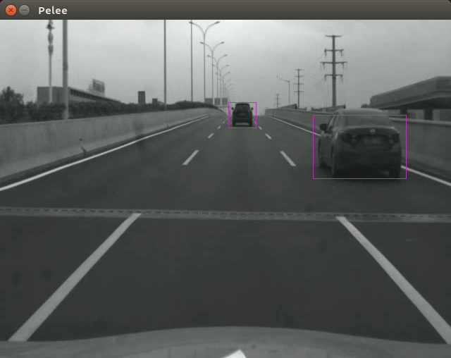

# Pelee-TensorRT

**Accelerate Pelee with tensorRT**
Pelee: A Real-Time Object Detection System on Mobile Devices (NeurIPS 2018) 

**TensorRT-Pelee can run over 70FPS(11ms) on Jetson TX2(FP32)**

---

**Performance:**
Jetson TX2: 72 FPS, 13.8 ms (FP32) <br>
Titan V:  200FPS, 5 ms (FP32)<br>

**GPU Time:**

**Time by layers:**


**Requierments:**

1.TensorRT4 (Jetpack 3.3 on TX2) 

2.CUDA 9.0

3.cudnn7

---

**Run:**

```shell
cmake .
make
./build/bin/pelee
```

---

**Reference:**

https://github.com/Ghustwb/MobileNet-SSD-TensorRT

---

**TODO:**
- [ ] FP16 Implementation 
- [ ] Change Custom layers IPlugin to IPluginExt


**The bug has been fixed**


